<p align="center">
  
</p>

# 🧠 Project Description

**cognito.ai** is a natural‑language forensic evidence discovery engine for UFDR (Universal Forensic Extraction Device Report) data. It ingests UFDR exports, normalizes heterogeneous schemas with deterministic IDs, and indexes into Elasticsearch search engine using category‑aware mappings. [ [Project Demo](https://www.youtube.com/watch?v=nPmozZFyn9Q) | [Project Abstract](https://docs.google.com/document/d/1MFKM0IF8x_RIVlebnfSWHOk4HerEkuZhx3HQc1r5wIs/edit?usp=sharing) | [Project PPT](https://docs.google.com/presentation/d/1n7_xvl8xx3r6QOR7TCP-oiH9NknoiszoKVyfP6TVlBM/edit?usp=sharing) ]

**Built for** [Smart India Hackathon - 2025](https://sih.gov.in)

### Key Features

- **Real-time Search**: Elasticsearch with category-aware mappings and faceted filters.
- **UFDR Ingestion**: normalized schemas and deterministic IDs across heterogeneous exports.
- **Natural-Language Querying**: Gemini-powered NLQ translated to Elasticsearch DSL.
- **Secure Persistence**: MongoDB storage with JWT-based authentication.
- **Visual Analytics**: timeline and network views, case drill-downs, exportable reports.
- **Dev-Friendly Setup**: Docker Compose for ES + Mongo; FastAPI + Next.js local dev.

**[📄 Sample AI-Generated Report](https://trycognito-ai.vercel.app/sample_report.pdf)** - See an example of our platform's comprehensive forensic analysis output.

## 🗂️ Project Structure

```
.
├── backend/
│   ├── app/
│   │   ├── core/                # Settings, DB/ES bootstrap
│   │   ├── models/              # Pydantic models (UFDRDocument)
│   │   ├── routes/              # FastAPI routes
│   │   ├── services/            # Elasticsearch, parser, classifier, AI intent planner
│   │   ├── utils/               # Helpers
│   │   └── main.py              # FastAPI app entrypoint
│   ├── data/                    # Sample data (e.g., ufdr.jsonl)
│   ├── pyproject.toml           # Python deps
│   └── uv.lock                  # Locked dependency resolution
├── frontend/
│   ├── app/                     # Next.js app routes/pages
│   ├── components/              # UI & dashboard components
│   ├── hooks/, lib/, styles/    # Frontend utilities
│   └── package.json             # Web deps
├── scripts/                     # Utilities (reindex, test API)
├── docker/                      # Docker configuration files
├── docs/                        # Misc docs
└── docker-compose.yaml          # Local Elasticsearch
```

## 🏗️ Project Design

<p align="center">
  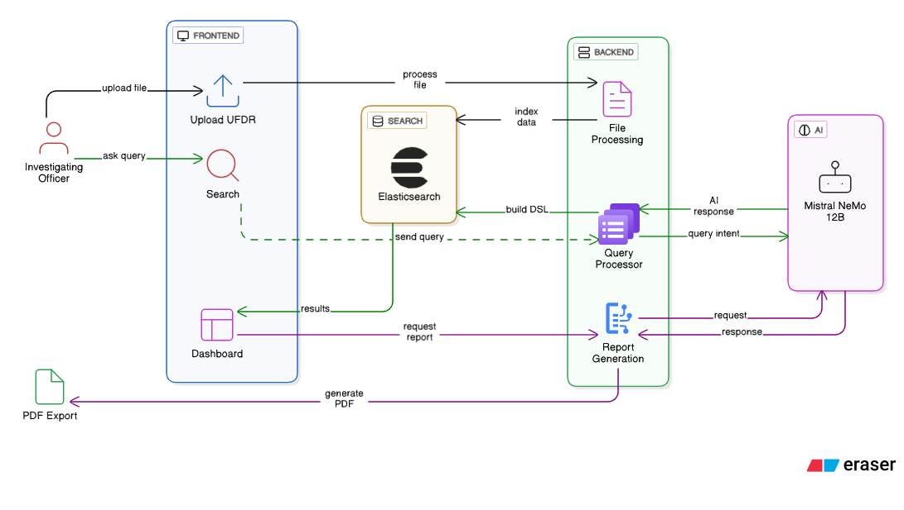
  <br>
  System Architecture
</p>

<p align="center">
  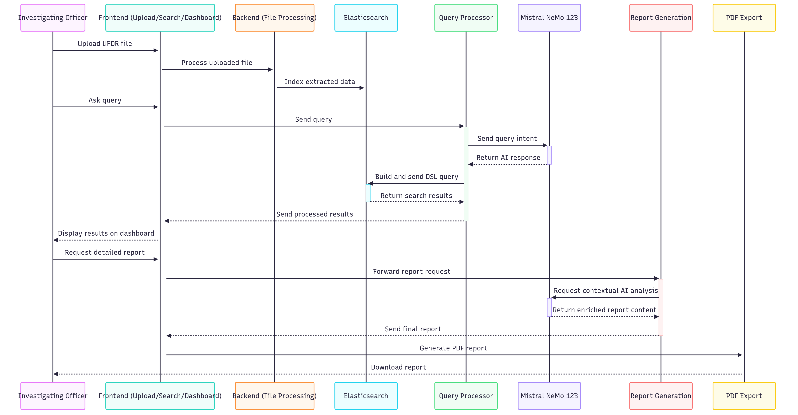
  <br>
  Sequence Diagram
</p>

## 🎯 Project Milestones

### Completed:

- [x] Add Elasticsearch indexing support for UFDR documents ([@areeb](https://github.com/areebahmeddd))
- [x] Define schema support in Elasticsearch for multiple file data types ([@areeb](https://github.com/areebahmeddd))
- [x] Build Gemini-powered NLQ layer to dynamically generate Elasticsearch DSL queries ([@areeb](https://github.com/areebahmeddd))
- [x] Integrate MongoDB ([@shivansh](https://github.com/SpaceTesla))
- [x] Implement JWT-based authentication system ([@shivansh](https://github.com/SpaceTesla))
- [x] Develop pipeline to extract TSV and convert to JSON from UFDR files ([@hamad](https://github.com/therealhamad))
- [x] Add Neo4j visualization support ([@avantika](https://github.com/avii09))
- [x] Enable report export generation ([@bhavana](https://github.com/bhaaaav))
- [x] Design and implement web UI ([@areeb](https://github.com/areebahmeddd), [@shivansh](https://github.com/SpaceTesla))
- [x] Set up CI/CD pipeline for DigitalOcean + Cloudflare Pages deployment ([@areeb](https://github.com/areebahmeddd))

### In Progress:

- [ ] Upgrade NLQ layer with Mixtral NeMo (12B SLM) support ([@anish](https://github.com/Av7danger))
- [ ] Upgrade ETL pipeline to better sync with multiple services ([@areeb](https://github.com/areebahmeddd))
- [ ] Develop ETL pipeline for additional file types ([@hamad](https://github.com/therealhamad))
- [ ] Write Pytest tests ([@avantika](https://github.com/avii09))
- [ ] Write Cypress tests ([@shivansh](https://github.com/SpaceTesla))
- [ ] Configure NGINX ([@areeb](https://github.com/areebahmeddd))
- [ ] Set up CI workflow to generate dynamic docs on merges to `testing` branch ([@bhavana](https://github.com/bhaaaav))
- [ ] Add Redis caching for search results ([@avantika](https://github.com/avii09))

## 🖼️ Project Preview

<p align="center">
  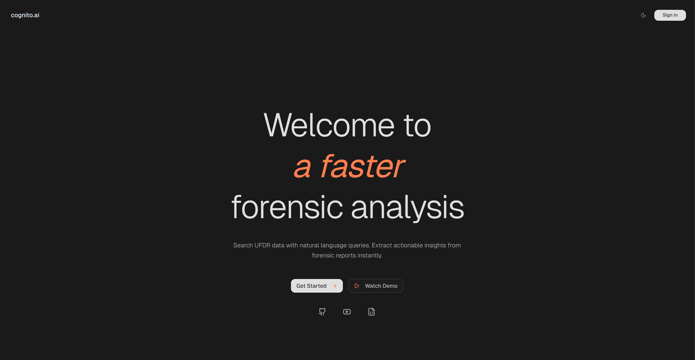
  <br>
  Landing Page
</p>

<p align="center">
  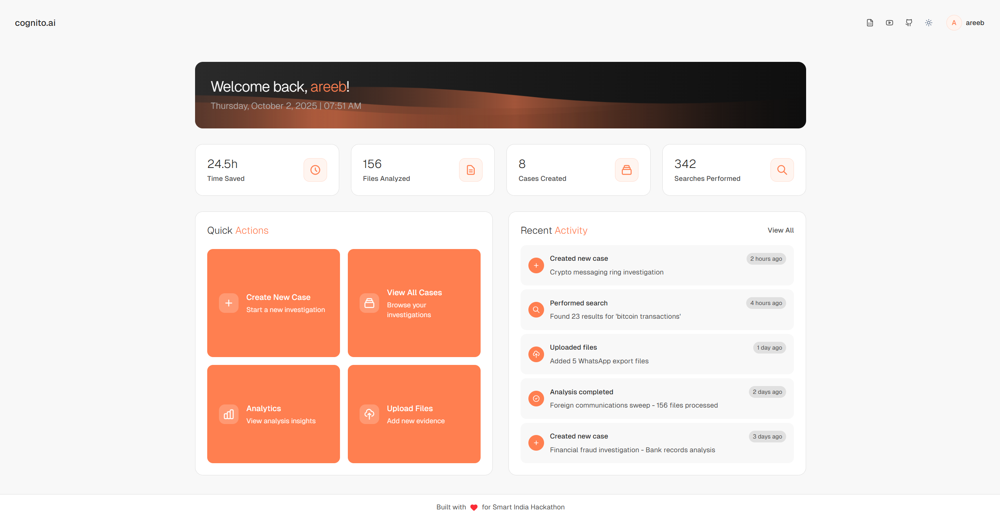
  <br>
  Home Page
</p>

<p align="center">
  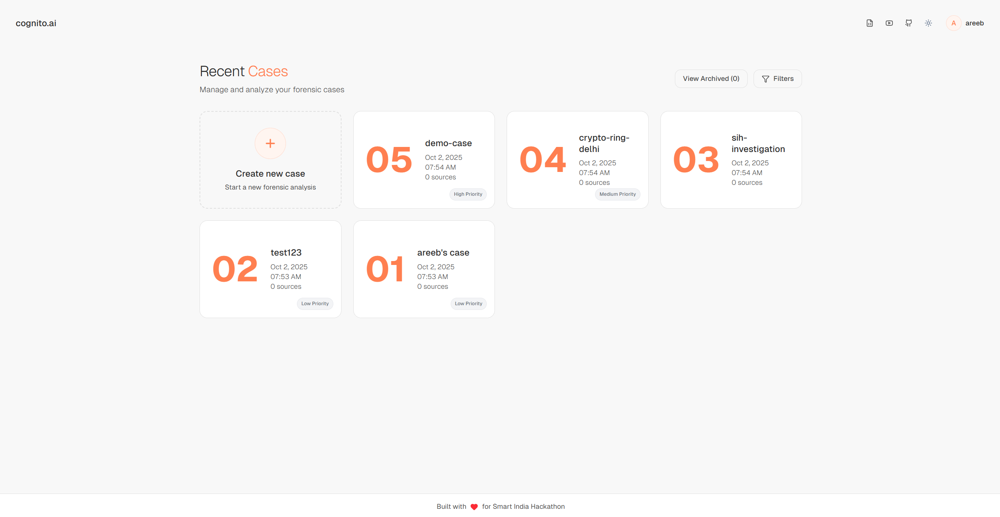
  <br>
  Your Cases Page
</p>

<p align="center">
  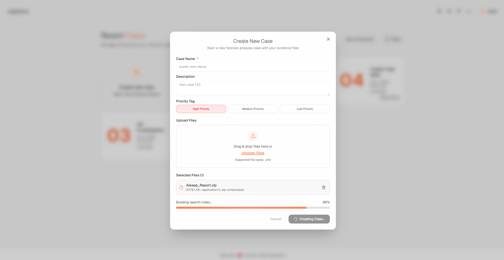
  <br>
  Create Case Modal
</p>

<p align="center">
  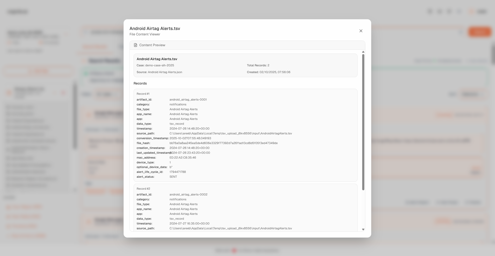
  <br>
  UFDR Artifact Inspector
</p>

<p align="center">
  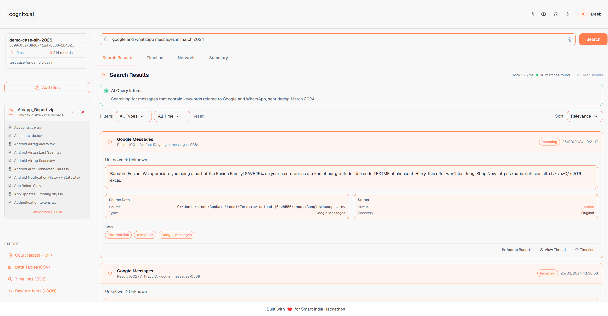
  <br>
  Search Results Page
</p>

<p align="center">
  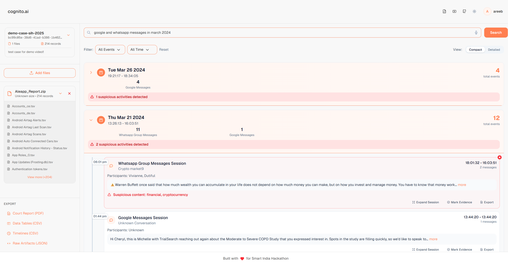
  <br>
  Timeline Analysis Page
</p>

<p align="center">
  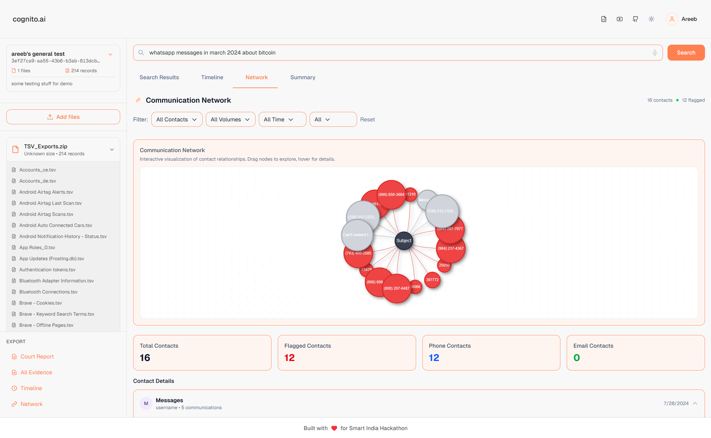
  <br>
  Network Correlation Page
</p>

<p align="center">
  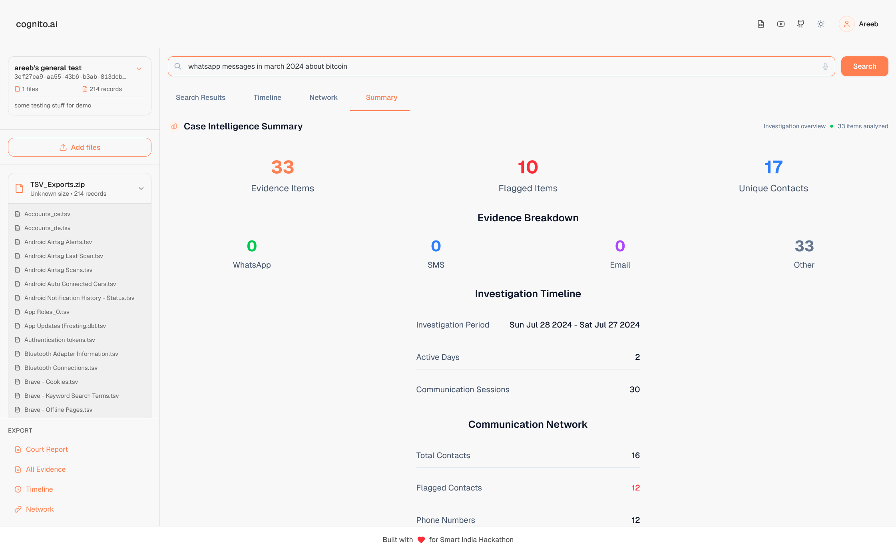
  <br>
  Case Summary Page
</p>

## ⚙️ Setup for Development

1. Clone the repo:

```bash
git clone https://github.com/areebahmeddd/cognito.ai.git
cd cognito.ai
```

2. Start Elasticsearch (single-node) via Docker Compose:

```bash
docker compose up -d
```

3. Configure environment variables:

Create a `.env` file in `backend/`:

```
ELASTICSEARCH_URL=http://localhost:9200
ELASTICSEARCH_INDEX=cognito
MONGODB_CONNECTION_STRING=mongodb://localhost:27017/cognito
GEMINI_API_KEY=<your_api_key>
```

Create a `.env` file in `frontend/`:

```
NEXT_PUBLIC_API_URL=http://127.0.0.1:8000/api/v1
```

## 🖥️ Backend (FastAPI)

Install and run API:

```bash
cd backend
uv sync
uv run app.main:app --host 0.0.0.0 --port 8000 --reload
```

Swagger UI: `http://localhost:8000/docs`

## 🌐 Frontend (Next.js)

```bash
cd frontend
npm clean-install
npm run dev
```

## 🧰 Scripts

### 1. Nuke Infra (Fresh Start)

Wipes Elasticsearch index (and wildcard) and then MongoDB database.

- Uses env vars with these defaults:
  - `ELASTICSEARCH_URL=http://localhost:9200`
  - `ELASTICSEARCH_INDEX=cognito`
  - `MONGODB_CONNECTION_STRING=mongodb://localhost:27017/cognito`

Run with Python from project root:

```bash
python scripts/nuke_infra.py
```

### 2. Generate Mock UFDR ZIPs (for testing)

Creates synthetic UFDR-like TSV bundles as ZIPs at the project root: `Test_UFDR-1.zip`, `Test_UFDR-2.zip`, `Test_UFDR-3.zip`.

```bash
python scripts/mock_zip.py
```

## 📜 License

This project is licensed under the [MIT License](LICENSE).

## 👥 Authors

- [Areeb Ahmed](https://github.com/areebahmeddd)
- [Hamad Hussain](https://github.com/therealhamad)
- [Shivansh Karan](https://github.com/SpaceTesla)
- [Anish Varma](https://github.com/Av7danger)
- [Avantika Kesarwani](https://github.com/avii09)
- [Bhavana Subramani](https://github.com/bhaaaav)
